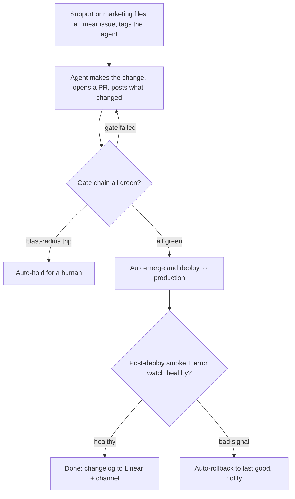

# Agentic delivery pipeline — requirements

## Summary

An autonomous delivery pipeline for `tangerine-webpage` where support and marketing request changes as Linear tickets, an AI agent makes the change and opens a PR, and it ships to production by itself once a layered gate chain passes — technical checks plus content/fact/brand checks against a source-of-truth — backed by a post-deploy smoke test, automatic rollback, and a plain-English change note on the ticket.

---

## Problem Frame

Today the only safety gate on this site is "does Astro build" — Vercel refuses to deploy a broken build, and nothing else is checked. There is no CI, no tests, no content validation, no monitoring, and no rollback procedure, and shipping still requires git.

Support and marketing can't ship site changes themselves; they route a request to a developer and wait. The goal is to remove that wait without removing safety: let non-coders request a change in the tool they already use (Linear), have an agent do the work, and ship it automatically — while making the automated safety net strong enough that nobody has to watch a deploy go out.

The hard part is not the agent writing code. It's that the requester can't read a code diff, so "reviewed and safe" has to be produced by the system, not a person.

---

## Key Decisions

- Autonomous-on-green, no human approval. Speed and genuine non-coder independence; safety is carried by the gate chain plus post-deploy rollback, not a reviewer.
- Separation of powers: the agent authors, deterministic CI gatekeeps. The agent cannot grade its own homework — gates run as CI the agent can't weaken, which is what makes "no human gate" trustworthy.
- One source-of-truth feeds both the agent and the content gates. The facts the agent writes from are the same facts the gates check against, so "docs" and "safety" are one artifact.
- Content correctness is a gate, not a hope. Valid-but-wrong content (a typo'd price) builds clean, so the chain includes content/fact/brand checks, not only technical checks.
- Hard-signal rollback for v1. Rollback triggers on objective signals (smoke failure, error spike), not business metrics, to avoid false rollbacks before there's a traffic baseline.
- Blast-radius guard keeps autonomy from being reckless. Normal edits auto-ship; abnormal changes (page deletions, dependency or build-config changes, oversized diffs) auto-hold for a human instead of shipping.

---

## Actors

- A1. Requester (support / marketing) — files the Linear issue and reads the change note; never reviews code.
- A2. Delivery agent — interprets the request, edits, opens the PR, fixes gate failures, writes the change note.
- A3. Gate chain (deterministic CI) — runs the technical, content, and blast-radius checks; the actual gatekeeper.
- A4. Deploy + rollback system — publishes on green, reverts to last-good on a bad signal.
- A5. Monitoring — post-deploy smoke test and error-rate watch.
- A6. Maintainer (developer) — owns gate definitions and source-of-truth governance, and handles blast-radius holds; does not review individual changes.

---

## Key Flows

- F1. Normal change (copy or stat edit)
  - **Trigger:** A requester files a Linear issue and tags the agent.
  - **Steps:** Agent edits, opens a PR, posts a plain-English summary; gate chain runs green; change auto-merges and deploys; post-deploy smoke passes.
  - **Outcome:** Change is live; a changelog entry lands on the Linear issue. No human acted after the request.
  - **Covered by:** R1, R2, R3, R4, R8, R10, R17

- F2. Gate failure (nothing ships)
  - **Trigger:** A gate (technical or content) fails on the PR.
  - **Steps:** Merge is blocked; the agent is handed the failure and attempts a fix; the chain re-runs.
  - **Outcome:** Either a later run goes green and ships, or it stays blocked — production is never touched.
  - **Covered by:** R4, R9

- F3. Bad deploy → auto-rollback
  - **Trigger:** Post-deploy smoke fails or error-rate spikes.
  - **Steps:** System reverts to the last known-good deploy and notifies the team + the Linear issue.
  - **Outcome:** Site is healthy again within minutes with no human action; the incident is recorded.
  - **Covered by:** R10, R11, R12, R13

- F4. Blast-radius hold
  - **Trigger:** A change exceeds normal-edit bounds (page deletion, dependency/build-config change, oversized diff).
  - **Steps:** The change is held and a maintainer is notified to review/approve before it can proceed.
  - **Outcome:** Catastrophic-class changes never auto-ship, while normal edits remain human-gateless.
  - **Covered by:** R7

---

## Requirements

**Authoring & intake**

- R1. Support and marketing request a site change by creating a Linear issue and tagging the delivery agent; no git, terminal, or code knowledge is required of the requester.
- R2. The agent makes the change on a branch and opens a pull request linked back to the originating Linear issue.
- R3. The agent posts a plain-English "what changed" summary (what, where, why) to the Linear issue when it opens the PR.

**Gate chain (pre-merge safety)**

- R4. Every PR must pass a deterministic gate chain before merge; any failing gate blocks the ship and returns the PR to the agent — it never reaches production.
- R5. Technical gates verify the change isn't broken: build/typecheck, internal link integrity, accessibility checks, and a visual-regression diff against current production pages.
- R6. Content gates verify the change is correct: facts, figures, prices, and links validated against the source-of-truth; brand-voice and forbidden-claims checks; spelling/grammar; and Tangerine®/RTI trademark usage.
- R7. A blast-radius guard auto-holds a change for a human when it exceeds normal-edit bounds (oversized diff, page deletion, dependency change, or build-config change) rather than auto-shipping it.

**Autonomous merge & deploy**

- R8. When all gates are green, the change merges and deploys to production with no human approval step.
- R9. A change that builds but fails any gate is never published; green is the only path to production.

**Post-deploy safety net**

- R10. After each production deploy, a synthetic smoke test verifies key pages return 200, render without JS console errors, and contain their critical elements (e.g., nav, hero, pricing tiers).
- R11. Production error-rate is monitored after each deploy.
- R12. When the smoke test fails or error-rate spikes, the system automatically rolls back to the last known-good deploy with no human action required to recover.
- R13. Every rollback notifies the team and is recorded against the originating Linear issue.

**Source-of-truth & agent operability**

- R14. A machine-readable source-of-truth holds the site's authoritative facts (prices, statistics, claims, trademark rules) and is the single reference both the agent and the content gates use.
- R15. Living agent-operability docs (conventions, page/content inventory, how to change things) are kept current so the agent makes correct changes as the site evolves.
- R16. A change that alters facts or conventions updates the source-of-truth and agent docs in the same change, so they don't drift from the live site.

**Visibility**

- R17. Each merged change produces a plain-English changelog entry posted to the Linear issue and a team channel, enough for a non-coder to understand what shipped and request a revert by reference.

**Governance**

- R18. The agent authors changes but cannot modify or weaken the gate chain; gate definitions are owned and changed outside the agent's autonomous path.

---

## Acceptance Examples

- AE1. Content gate catches valid-but-wrong content
  - **Covers R6.**
  - **Given** the source-of-truth lists the Premium tier at $5,000, **when** a change sets it to $500, **then** the content gate fails and the change does not merge.

- AE2. Bad deploy auto-rolls back
  - **Covers R10, R12.**
  - **Given** a change deploys and the post-deploy smoke test finds a key page returning a JS error, **when** the smoke test fails, **then** the site auto-reverts to the previous deploy and the team is notified — without anyone intervening.

- AE3. Page deletion is held, not shipped
  - **Covers R7.**
  - **Given** a change deletes a page or bumps a dependency, **when** the blast-radius guard trips, **then** the change is held for a maintainer instead of auto-shipping, even though all other gates are green.

- AE4. Broken build never reaches production
  - **Covers R9.**
  - **Given** a change that fails to build, **when** the gate chain runs, **then** it is blocked at the technical gate and production is unaffected.

---

## Success Criteria

- A support or marketing person ships a real copy or stat edit to production through a Linear ticket, with no developer involvement and nobody watching the deploy.
- A valid-but-wrong change (e.g., a wrong price) is blocked before production by the content gate.
- A bad deploy is detected and rolled back automatically within minutes, with a notification and no human action.
- A non-coder can read the change note and understand what shipped without reading code.
- The source-of-truth and agent docs stay current as changes ship — no drift from the live site.

---

## Scope Boundaries

**Deferred for later**

- Analytics / business-metric rollback (conversion drop, Core Web Vitals regression).
- Human escalation beyond the blast-radius guard (e.g., a broader sensitive-content list).
- Optional human-approval or code-review modes, re-enabled per change-type if ever wanted.
- Human editing/help guides and a broader documentation suite beyond agent-operability docs.
- Extending the pattern to other SignLab repos or products.

**Outside this effort**

- Wiring the contact and free-trial form backends (a separate, already-flagged follow-up).
- Custom domain setup.
- Building or selecting the agent product itself — a planning/implementation concern, not a product decision here.

---

## Dependencies / Assumptions

- Assumes an AI coding agent can be tagged on a Linear issue and act on this GitHub repo. Linear, GitHub, and Vercel are connected, and PostHog is available for monitoring; the specific agent capability and its PR mechanics are to be confirmed in planning.
- Assumes the source-of-truth is created and seeded before autonomy is enabled — the safety of the whole loop depends on it existing and being current.
- First slice (assumption — the choice was left to judgment): an existing copy or stat edit on a current page, which exercises the full loop end to end; new pages, structural changes, and logic changes layer on after that's trusted.
- Counterfactual (assumption): today support/marketing cannot ship changes themselves and must route through a developer; this pipeline replaces that wait.
- Assumes Vercel's instant rollback to a prior deploy is the rollback mechanism.

---

## Outstanding Questions

None of the open items block the start of planning — all are answerable during it.

**Deferred to planning**

- Which agent runs in the loop. The stated flow points to a Linear-assignable coding agent; confirm the specific product and its PR mechanics.
- Where the source-of-truth lives and its shape, so the agent and the gates share one reference.
- What counts as "key pages" and "critical elements" for the smoke test, and the error-rate threshold that triggers rollback.
- Blast-radius thresholds: diff size and which paths/files (config, dependencies, page files) trip the hold.
- Exact gate implementations (visual-diff, accessibility, link, spell/grammar, brand/claims linting).
- Notification wiring (Linear comment plus which team channel).
- How the "what changed" and changelog summaries are generated and formatted.

---

## Sources / Research

- Current state: no CI (`.github/workflows` absent); the only gate today is Vercel's build-on-push. `package.json` has only Astro `dev`/`build`/`preview` (no test/lint/typecheck scripts). No monitoring or analytics wired into `src/`. Git → GitHub → Vercel auto-deploy is live and verified.
- Platforms available in this environment: Linear, GitHub, Vercel (project `teamsignlab/tangerine-webpage`), and PostHog (error tracking + web analytics) for monitoring.
- An unused lint config exists at `reference/_adherence.oxlintrc.json` (from the design system) — a candidate to wire into the technical gate.
- Site design context: `docs/plans/2026-06-05-tangerine-astro-design.md`.
