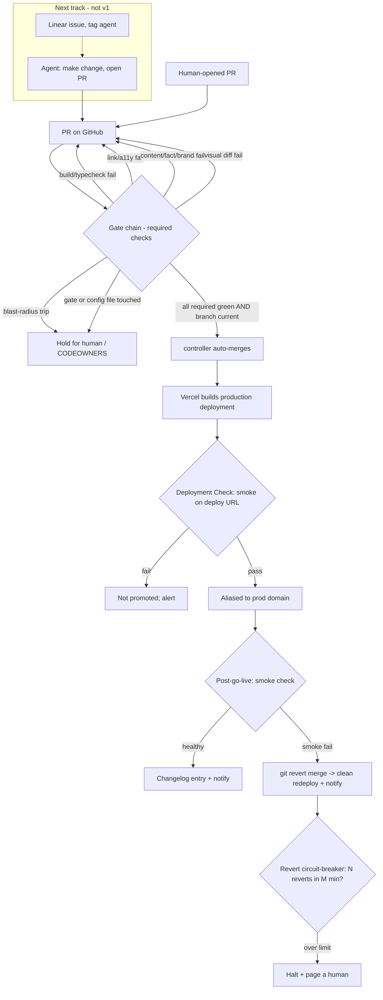

# feat: Autonomous delivery safety net for tangerine-webpage

## Summary

Build the deterministic safety net that lets changes ship to production autonomously: a GitHub Actions gate chain (build/typecheck, links, accessibility, content/fact/brand checks, visual-regression diff, blast-radius guard), auto-merge on all-green with no human approval, a post-deploy smoke test, automatic rollback on bad signals, and the source-of-truth + agent-operability docs that make autonomous changes correct. v1 makes shipping *safe* for any PR; non-coder self-service (the Linear "tag an agent" front door) is the immediate next track layered on top — until it lands, this pipeline benefits whoever opens PRs, not yet support/marketing directly.

---

## Problem Frame

Today the only safety gate is "does `astro build` succeed" — Vercel refuses to deploy a broken build, nothing else is checked. There is no CI, no tests, no content validation, no monitoring, no rollback. The brainstorm (see origin) chose full autonomy on green: with no human reviewing diffs, the automated gates *are* the entire pre-ship safety model, and a post-deploy net catches what slips through.

The failure mode that matters most is not "broken" but "valid-but-wrong": a typo'd price (`$500` for `$5,000`) builds clean, passes a smoke test, and ships. The repo already demonstrates this class of bug — the home page renders "60+ countries" while the Impact page, Footer, and About page all say "65+". A safety net that only checks technical correctness would ship that. So content correctness has to be a gate, anchored to a single source-of-truth — and because appearance *is* the product on a marketing site, a layout break has to be caught too, which is why a light visual-regression gate is in v1 rather than deferred.

---

## Key Technical Decisions

- KTD1. Separation of duties enforced structurally (R18). The agent authors content but a human owns the gate/config/truth files via `CODEOWNERS`. The agent operates as a **least-privilege GitHub App identity** — not a repo admin, not a CODEOWNER, not on the branch-protection bypass list — so it cannot edit branch protection, self-approve a CODEOWNER-gated change, or weaken a gate. The auto-merge controller (U7) merges with a token that *satisfies* required checks, never one that bypasses them. This is the load-bearing decision the rest depends on; "empty bypass list" alone is necessary but not sufficient without pinning the identity.

- KTD2. Auto-merge via a `check_suite: completed` controller, not "enable auto-merge on open." GitHub changed auto-merge on 2026-03-25 so it can only be enabled once requirements are already met (else HTTP 422), breaking the classic enable-on-open flow. Use **classic branch protection** (0 required reviewers + required status checks) rather than rulesets for the auto-merge combo (documented rulesets/auto-merge incompatibility). The controller re-queries the **full required-check set** on each `check_suite: completed` event and merges only when every required check is green and the branch is up to date — a single completed suite is not "all green," and a missing/renamed check must read as not-green (fail closed).

- KTD3. Rollback = `git revert` of the merge commit (primary); Vercel Instant Rollback is the manual fast fallback. The Vercel rollback API freezes production auto-assignment until someone manually promotes a build — `git revert` instead ships a clean prior state through the normal pipeline and keeps git as the single source of truth. The **post-deploy smoke test is the sole automatic rollback trigger**. (Continuous error-rate monitoring is dropped from v1 — see Scope; smoke is v1's only post-deploy detector.) The controller carries a **revert circuit-breaker**: it identifies reverts, never auto-reverts a revert, and halts + pages a human after N reverts in M minutes.

- KTD4. Smoke test gates promotion via Vercel Deployment Checks where the plan tier supports it, with a post-merge smoke job as the baseline. A built production deployment is verified before it is aliased to the production domain, so a bad build never reaches users; the post-go-live smoke + rollback remains the net for signals that only appear after traffic hits. Where pre-promotion gating isn't available, the safety model degrades to post-promotion smoke + rollback — stated, not assumed.

- KTD5. Content correctness = source-of-truth + rendered-output assertion. Facts (prices, stats, claims, trademark rules) live in one machine-readable file, Zod-validated so malformed data fails the build. A gate asserts the built HTML contains each enumerated fact on its expected page, and flags stray number/price-shaped strings (not only `$`-prefixed — the 60+/65+ bug is a bare number) that don't map to a truth entry, with per-page scoping so unrelated copy (e.g. a bio's "20+ countries") isn't a false positive. The gate catches page↔truth *divergence*; changing a fact's *value* is a truth-file edit, which is CODEOWNER-gated — a human approves fact changes by design. Centralizing facts also fixes the existing 60+/65+ inconsistency.

- KTD6. Brand/claims/trademark/spelling via Vale. A markup-aware prose linter enforces forbidden-claims (no "guaranteed", "#1", unapproved superlatives), terminology and Tangerine®/RTI trademark usage, and spelling. Its config lives under `CODEOWNERS` so the agent can't disable a rule it trips; an optional grep gate fails on `vale off` appearing in a content diff.

- KTD7. Blast-radius guard via Danger JS as a required check that **fails** (holds), not just warns (R7). It holds a PR for a human on oversized diffs, deletion of any `src/pages/**` or `src/data/**` file, and changes to dependency/build/gate config. Held PRs can't auto-merge even when every other check is green.

- KTD8. Light visual-regression in v1; depth deferred. Because a layout break keeps elements present (so smoke passes) and throws no JS error (so PostHog stays quiet), it would otherwise have no detector — unacceptable for a marketing site. v1 ships Playwright committed-baseline screenshots of the key pages, diffed against baselines (never live prod, which would flag every intended change). Hosted review UIs and broader page coverage are the deferred depth.

- KTD9. Linear intake deferred to the immediate next track. The "tag an agent on an issue → it opens a PR and reports back" front door needs an OAuth app (`actor=app`, `app:assignable`/`app:mentionable`), a webhook receiver that acks within 10 seconds and runs the coding agent async, and agent-activity posting — and the Agent Interaction SDK is still developer-preview. It layers on the safety net (the prerequisite). Eyes open: until it lands, v1 delivers a safe pipeline but **zero non-coder self-service**, which is the brainstorm's headline goal — so intake is the next track, not a someday-maybe.

- KTD10. The unused `reference/_adherence.oxlintrc.json` is a *spec*, not a runnable gate. It targets JSX, won't lint `.astro`, and its no-raw-hex/no-px rules already fail the live tree. Re-express its design-system rules (token names, component prop enums, font allowlist) as an Astro-aware convention check that starts as warnings, not a drop-in lint config.

---

## High-Level Technical Design

Gate order is cheap-to-expensive so fast failures short-circuit: build/typecheck → link check → accessibility → content/fact assertion → Vale prose → visual-regression diff → blast-radius (Danger). All are required status checks; auto-merge is only as safe as the required-check set, so the controller verifies the whole set and a missing/renamed check fails closed.

---

## Scope Boundaries

**In scope (this plan)**
- CI gate chain on PRs: build/typecheck, internal links, accessibility, content/fact assertion, brand/claims/trademark, light visual-regression diff, blast-radius guard.
- Source-of-truth facts file + centralizing scattered stats + fixing the 60+/65+ bug.
- Auto-merge-on-green controller (full-required-set verification) + classic branch protection + CODEOWNERS separation + least-privilege agent identity.
- Post-deploy smoke test + Vercel deployment-check gating + auto-rollback (git-revert, circuit-breaker) + notify.
- Agent-operability docs (AGENTS.md, route/content map, conventions) + changelog automation.

### Deferred to Follow-Up Work
- Linear agent intake front door (OAuth app, webhook receiver, async runner, agent-activity posting, PR↔issue linking) — **the immediate next track** (KTD9); v1 is not non-coder self-service without it.
- Visual-regression depth: more pages, hosted review UI (e.g. reg-suit/S3), cross-browser — beyond the v1 key-page baseline set.
- Error-rate monitoring + alerting (R11) — PostHog (or similar) error autocapture: dropped from v1 for now; v1's only post-deploy detector is the synthetic smoke test. Add back when there's appetite for ongoing observability (with source-map upload for readable traces).
- Checkly (or similar) continuous hosted synthetic monitoring beyond the deploy moment.
- Posting changelog/rollback notices *into the Linear issue* (depends on the intake track); until then, channel + changelog file.

### From origin — deferred for later
- Analytics/business-metric rollback (conversion, Core Web Vitals).
- Human escalation beyond the blast-radius guard; optional human-approval modes.
- Extending the pattern to other SignLab repos.

### Outside this effort
- Wiring the contact/trial form backends; custom domain. Vercel **Pro** plan (only needed if rollback must target deployments older than the immediately previous one, or for pre-promotion Deployment Checks if the tier requires it).

---

## Implementation Units

### U1. CI foundation: scripts, Node pin, build + typecheck gate

- **Goal:** Stand up GitHub Actions CI that runs on every PR and gates on build + typecheck. (R4, R5 partial, R9 — link/a11y in U2, visual in U13)
- **Dependencies:** none.
- **Files:** `package.json` (add `typecheck`, `lint`, `test` scripts; add `@astrojs/check` + `typescript` devDeps), `.nvmrc` (pin Node, aligned with `engines`), `.github/workflows/ci.yml` (new).
- **Approach:** Add `astro check` as the typecheck gate. Pin one Node version for reproducible CI/Vercel builds. Workflow triggers on `pull_request`, installs deps, runs `astro check` and `astro build`; `dist/` is reused by later page-level gates. Use unique, stable, environment-qualified job names (duplicate/renamed names collide with branch protection + Vercel checks). **Secrets:** PR-triggered gate jobs must NOT receive deploy/monitoring secrets (`VERCEL_TOKEN`, PostHog keys) — they run agent-authored code before any human review, so an exfiltration step would otherwise reach prod credentials. Keep gates secret-free; deployment is Vercel's git integration, not a token in PR CI.
- **Patterns to follow:** existing `package.json` script style; `astro.config.mjs` static output.
- **Test scenarios:** `Covers AE4.` Broken build → CI fails, PR not mergeable. Type error → `astro check` fails. Clean PR → passes. A workflow step referencing a deploy secret in a `pull_request` job → flagged/absent (secrets not exposed to PR CI).
- **Verification:** A PR with a deliberate type error and a clean PR show expected red/green; no deploy secret is referenceable from PR gate jobs.

### U2. Technical gates: internal link + accessibility checks

- **Goal:** Add link-integrity and accessibility gates against the built site. (R4, R5 partial)
- **Dependencies:** U1.
- **Files:** `.github/workflows/ci.yml` (add jobs), `lychee.toml`, `.pa11yci.json`.
- **Approach:** Run **lychee** over `dist/` for internal links/anchors (scope to internal/offline so flaky external links don't block merges). Run **pa11y-ci** against a page list **generated from `src/data/nav.ts` `ROUTES` + the `getStaticPaths` keys** (not hardcoded), with a failure threshold.
- **Patterns to follow:** routes centralized in `src/data/nav.ts`; derive lists from `ROUTES`/`TG_PRODUCTS`/`TG_HELP` keys.
- **Test scenarios:** Broken internal link → lychee fails. A11y violation above threshold → pa11y fails. Clean build → both pass.
- **Verification:** A dead internal link and an a11y regression each fail the right check; baseline passes.

### U13. Light visual-regression gate

- **Goal:** Catch layout breaks that keep elements present but render wrong — the failure class no other v1 gate detects. (R5 — completes the visual-regression portion; KTD8)
- **Dependencies:** U1. (Belongs with the Phase A technical gates; numbered U13 per ID stability.)
- **Files:** `.github/workflows/ci.yml` (add job), `tests/visual.spec.ts`, `tests/__screenshots__/**` (committed baselines).
- **Approach:** Playwright `toHaveScreenshot()` over the key pages (the same `ROUTES`-derived set as smoke). Diff against **committed baselines, never live prod** (diffing prod flags every intended change, which an autonomous agent can't adjudicate). When a change intends a visual update, the baseline is updated in the same PR — and because baselines live where the change is, an unexpected diff on an unintended page is the real signal. Pin a Playwright container so local and CI render identically (avoid cross-platform pixel drift).
- **Patterns to follow:** Playwright shared with U8 smoke; `ROUTES`-derived page list.
- **Test scenarios:** `Covers AE5.` A CSS change that breaks a grid (elements still present) → visual diff fails. An intended copy edit with baseline updated in the same PR → passes. A diff on a page the PR didn't intend to touch → fails.
- **Verification:** A seeded layout break fails the visual job while build/smoke stay green, proving it catches what they miss.

### U3. Facts source-of-truth + centralize scattered facts

- **Goal:** Create one machine-readable facts file and render all facts from it, fixing the existing 60+/65+ inconsistency. (R14, R16)
- **Dependencies:** U1.
- **Files:** `src/data/facts.ts` (or an Astro content collection + `src/content.config.ts` with a Zod schema), `src/pages/index.astro`, `src/pages/impact.astro`, `src/components/Footer.astro`, `src/pages/about.astro`, `src/data/home.ts`.
- **Approach:** Enumerate authoritative facts: prices (already clean in `TG_PRICING`), stats (countries, languages, organizations, assessments — currently hardcoded as `<Stat>` literals and inline prose in ≥5 places, in mixed formats like `65+` vs `65 countries` vs `5M+` vs `5 million`), and trademark rules (when `®` is required). Record each fact with its canonical value, its allowed render forms, and the pages it appears on (so U4 can scope assertions). Zod-validate so malformed data fails the build. Refactor inline literals/prose to render from the file; resolve the country figure to one canonical value everywhere. Distinguish site stats from incidental numbers in bios (e.g. "20+ countries") so they aren't conflated.
- **Patterns to follow:** typed data modules in `src/data/`; `<Stat>` component API; `class:list`.
- **Test scenarios:** Schema rejects a malformed fact → build fails. After refactor, every page renders the same canonical country figure. Bio numbers remain untouched and unconflated with site stats.
- **Verification:** Grep across `dist/` shows a single country value; build fails on an intentionally malformed entry.

### U4. Content/fact assertion gate

- **Goal:** Assert the built HTML matches the source-of-truth — for prices AND stats — and flag unmapped fact-shaped strings. (R4, R6)
- **Dependencies:** U3.
- **Files:** `tests/content-truth.spec.ts`, `.github/workflows/ci.yml` (add required job).
- **Approach:** For each fact in the truth file, assert its value is present on each page the file lists for it (per-page scoping). Scan `dist/` for price-shaped (`/\$[\d,]+/`) AND bare stat-shaped (`/\b\d[\d,]*\+?\b/` constrained to stat contexts/elements) strings on fact-bearing pages and fail on any not mapped to a truth entry — so a non-dollar typo (a recurrence of the 60+/65+ class) is caught, while bio/incidental numbers (scoped out) are not flagged. Add an **inverse coverage check**: every fact-bearing element on the key pages must map to a truth entry, so coverage can't silently fall behind as content grows.
- **Execution note:** Write the failing assertion first against a seeded wrong price and a seeded wrong stat, then implement the gate.
- **Test scenarios:** `Covers AE1.` Price changed to `$500` while truth says `$5,000` → fails. A stat changed to an unmapped value (e.g. `70+ countries`) → fails. A hardcoded `$49` not in truth → fails. A new fact-bearing element with no truth entry → inverse check fails. Bio "20+ countries" → not flagged. Correct content → passes.
- **Verification:** Seeded wrong/stray price and stat each fail; an unmapped new fact fails the inverse check; reverting passes.

### U5. Brand, claims, trademark & spelling linting (Vale)

- **Goal:** Gate prose for forbidden claims, terminology/trademark, and spelling. (R4, R6)
- **Dependencies:** U1.
- **Files:** `.vale.ini`, `vale/styles/**`, `.github/workflows/ci.yml` (add job).
- **Approach:** Vale over content (`src/data/*.ts` copy + `.astro` prose). Forbidden-claims rules block risky superlatives; substitution rules enforce brand spelling and trademark usage (when `®` is required vs optional — not every "Tangerine" needs it). Keep vocab/forbidden lists in-repo, under `CODEOWNERS`. Per `reference/HANDOFF.md`'s fidelity split, be strict on verbatim copy (Home/product/FAQ/About/Pricing) and lenient on "representative" copy (Impact/User Stories/Help) pending content-owner review.
- **Patterns to follow:** terminology source is `reference/HANDOFF.md` + `reference/_adherence.oxlintrc.json`.
- **Test scenarios:** "guaranteed"/"#1" → fails. Lowercase "tangerine" in a heading or wrong ® usage → flagged. `vale off` in a content diff → optional grep gate fails. Clean copy → passes.
- **Verification:** A seeded forbidden claim and a trademark violation each fail; baseline copy passes.

### U6. Blast-radius guard (Danger JS)

- **Goal:** Auto-hold risky changes for a human even when other checks are green. (R7)
- **Dependencies:** U1.
- **Files:** `dangerfile.js`, `.github/workflows/ci.yml` (Danger job as a required check).
- **Approach:** Danger **fails** when: additions+deletions exceed a threshold (e.g. ~400–600); any deleted file is under `src/pages/**`, `src/data/**`, or `public/**`; or the diff touches `package.json`, the lockfile, `astro.config.mjs`, `tsconfig.json`, `.github/**`, `.vale.ini`, or the Vale styles dir. A held PR waits for a CODEOWNERS approval/label.
- **Test scenarios:** `Covers AE3.` PR deleting a page → held. Dependency bump → held. Workflow-file change → held. Normal copy edit under threshold → passes.
- **Verification:** Each risky category fails Danger; a normal content PR passes.

### U7. Branch protection, CODEOWNERS & auto-merge controller

- **Goal:** Make green the only path to production and stop the agent from weakening gates. (R8, R9, R18)
- **Dependencies:** U1, U2, U13, U4, U5, U6 (all required checks must exist first).
- **Files:** `CODEOWNERS`, `.github/workflows/auto-merge.yml` (new), `docs/agent/pipeline-setup.md` (settings checklist).
- **Approach:** Classic branch protection on `main`: 0 required reviewers, all gate jobs required, no direct pushes, block force-push/branch deletion, **empty bypass list**. `CODEOWNERS` assigns a human to `.github/**`, `astro.config.mjs`, `package.json`, lockfile, `tsconfig.json`, `.vale.ini`, `vale/**`, `src/data/**` (truth files), `tests/**` (the gates). The **agent acts as a least-privilege GitHub App** (no admin, not a CODEOWNER — KTD1). `auto-merge.yml` triggers on `check_suite: completed`, **re-queries the full combined required-check state and the branch-up-to-date status**, and merges only when all green — using a token that satisfies (not bypasses) protection. **Serialize merges**: require the PR branch up to date before merge so two green PRs can't deploy an unevaluated combined tree. **Ordering (in setup doc):** land + prove all gates green on a real PR *before* enabling branch protection + the controller, or the gate-building PRs themselves get blocked with no path.
- **Test scenarios:** `Covers AE4.` Content PR, all required green, branch current → controller merges, no human. PR touching `astro.config.mjs` → held pending CODEOWNERS even when green. Failing/missing required check → never merges (fail closed). Two simultaneously-green PRs → second must update branch and re-pass before merge.
- **Verification:** A green content PR auto-merges; a green config-touching PR is held; a stale second PR is not merged until rebased + re-green.

### U8. Post-deploy smoke test + Vercel deployment check

- **Goal:** Verify each production deployment before/just after go-live; this is the sole auto-rollback trigger. (R10)
- **Dependencies:** U7.
- **Files:** `tests/smoke.spec.ts`, `.github/workflows/smoke.yml`, `docs/agent/pipeline-setup.md` (Vercel Deployment Checks config).
- **Approach:** Playwright over key pages (`ROUTES`-derived) asserting 200, no page-origin JS console errors, and a **per-route critical-element map** (not one global list, since pages differ): `.mk-nav` + `.mk-foot` everywhere; `.mk-hero` on `/`; `.mk-tier`/`.mk-tier__price` only on `/get-tangerine`; `.tg-stat` on `/` and `/impact`; the article body on a help page; `#contact-form` on `/contact`. Tolerate the contact/trial forms' intentional `preventDefault` (no network) and scope console-error assertions to page origin (so any later third-party script can't trip them). Wire as a Vercel Deployment Check gating prod-domain promotion where the tier supports it; also runs post-merge against the live URL.
- **Execution note:** Start from a failing smoke test against a known-broken page state.
- **Test scenarios:** `Covers AE2.` A key page non-200 → fail. A real page-origin JS error → fail. Missing `.mk-tier__price` on `/get-tangerine` → fail. `/contact` asserts `#contact-form`, not `.tg-stat`. Healthy deploy → pass. Forms' success-state stub and any third-party script failures → not flagged.
- **Verification:** Smoke fails on a seeded broken page and passes on the healthy build; per-route assertions don't false-fail on pages lacking other pages' elements.

### U9. Auto-rollback (git-revert primary) + notify

- **Goal:** Recover automatically from a bad deploy with no human action, without oscillating. (R12, R13)
- **Dependencies:** U8.
- **Files:** `.github/workflows/rollback.yml`, `scripts/rollback.mjs`, `docs/agent/pipeline-setup.md`.
- **Approach:** On smoke failure (U8), the controller pushes a `git revert` of the offending merge commit (handling the merge-commit parent: `-m 1` for merge commits, plain revert for squash — the merge method is fixed in U7's setup), redeploying the prior clean state, then notifies (channel + changelog; Linear comment deferred to the intake track). **Circuit-breaker:** tag revert commits, never auto-revert a revert, and after N reverts in M minutes halt the controller and page a human (a bad "prior state" must not loop). Document Vercel Instant Rollback (`vercel rollback` / API with `teamId`) as the manual fast fallback, noting it freezes prod auto-assignment until a manual `vercel promote`.
- **Test scenarios:** Simulated smoke failure → revert + redeploy to prior state + notify. A revert that itself fails smoke → not auto-reverted; circuit-breaker halts + pages after the limit. Concurrent-merge ambiguity → the offending commit is identified from the failing deploy's commit, not guessed.
- **Verification:** A forced smoke failure triggers an automatic git-revert and notification; a forced repeat failure halts and pages rather than looping.

### U11. Agent-operability docs (AGENTS.md + content/route map)

- **Goal:** Give the agent a current, machine-readable map so its changes are correct. (R15, R16)
- **Dependencies:** U3 (references the facts source-of-truth).
- **Files:** `AGENTS.md` (root), `docs/agent/conventions.md`, `docs/agent/content-map.md`.
- **Approach:** Document conventions re-expressed Astro-aware from the design-system spec (token names, component prop enums, font allowlist, `class:list` idiom, vanilla-island style, no raw hex/px); a route/content inventory derived from `ROUTES` + `getStaticPaths` keys; where each fact lives (pointer to the source-of-truth, and the rule that fact-value changes are CODEOWNER-gated); and a "how to make a change" guide. Generate the content map from the route map so it doesn't drift. Add `project_tracker: github` for issue-creation tooling.
- **Test scenarios:** `Test expectation: none -- documentation unit.` Optional CI check that `AGENTS.md`/content-map references resolve to existing routes.
- **Verification:** AGENTS.md lists all current routes and the facts file; an agent can locate where to change a price or stat from the docs alone.

### U12. Changelog automation

- **Goal:** Produce a plain-English "what changed" record on every merge. (R13, R17)
- **Dependencies:** U7.
- **Files:** `.github/workflows/changelog.yml`, `CHANGELOG.md` (or `docs/changelog/`).
- **Approach:** On merge to `main`, generate a non-coder-readable entry (what changed, where, link to deploy/commit) appended to a changelog and posted to a team channel, structured so a change can be referenced for rollback. Posting into the originating Linear issue is part of the deferred intake track.
- **Test scenarios:** A merge produces a changelog entry + channel post, readable without code knowledge and referencing the commit for revert.
- **Verification:** Merging a test change appends a clear entry and notifies the channel.

---

## Acceptance Examples

- AE1. Content gate catches valid-but-wrong content (origin AE1). Given the truth file lists Premium at `$5,000`, when a page renders `$500` while the truth file still says `$5,000`, U4 fails on the divergence and the change does not merge. (Changing the truth file's value itself is a CODEOWNER-gated human edit, not an autonomous path — that's the intended control for fact *changes*.)
- AE2. Bad deploy auto-rolls back (origin AE2). Given a deploy whose smoke test finds a JS error or non-200, U8 fails and U9 reverts to the prior good state and notifies — no human action — unless the circuit-breaker limit is hit, in which case it halts and pages.
- AE3. Page deletion is held (origin AE3). Given a change deleting a `src/pages/**` file or bumping a dependency, U6 holds it for a human even when other checks are green.
- AE4. Broken build never reaches production (origin AE4). Given a change that fails to build or typecheck, U1 blocks it and U7's required-checks rule prevents merge.
- AE5. Layout break is caught (KTD8). Given a CSS/structure change that keeps elements present but breaks the layout, U13's visual diff fails even though build, content, and smoke would pass.

---

## Risks & Dependencies

- **Agent identity is load-bearing and must be provisioned correctly:** a least-privilege GitHub App (no admin, not a CODEOWNER, not on bypass). If the agent ever runs under a human PAT that is a CODEOWNER/admin, KTD1 collapses. Verify the App's permission set during setup.
- **Secrets in PR CI:** mitigated by keeping deploy/monitoring secrets out of `pull_request` gate jobs (U1) and deploying via Vercel's git integration. Residual: audit that no workflow reachable from an agent PR can read those secrets.
- **Build-time vs deploy-time drift:** CI builds `dist/` for the gates; Vercel rebuilds independently for the deploy. Pin Node (`.nvmrc`) + Vercel project Node to the same version; keep env parity so the artifact the gates validated matches what ships.
- **GitHub auto-merge 422 (2026-03-25) + rulesets/auto-merge incompatibility:** mitigated by the `check_suite` controller + classic branch protection (KTD2). Confirm whether the queued GitHub fix has landed.
- **Required-check naming races:** unique, stable, environment-qualified job names; a deleted/renamed workflow makes the required check *missing* (fail closed).
- **Merge method fixes revert logic:** the chosen merge method (squash vs merge commit) determines `git revert` parent handling (`-m 1`); set it in U7 setup and honor it in `scripts/rollback.mjs`.
- **Vercel Deployment Check feasibility by plan tier:** pre-promotion gating may need a specific tier/config; where unavailable, the model is post-promotion smoke + rollback (KTD4) — a bad build briefly reaches the domain before smoke reverts it.
- **Visual baseline maintenance:** committed baselines need updating with intended visual changes and a pinned render container to avoid cross-platform pixel drift (KTD8); stale baselines cause false fails.
- **Low-traffic detection lag:** smoke runs at deploy; subtle issues invisible to element/visual checks (e.g. conversion harm) have no v1 detector (business-metric rollback is deferred).
- **Linear Agent Interaction SDK is developer-preview:** the next-track intake must pin to the documented schema and expect pre-GA change.

---

## Open Questions

**Deferred to planning of the intake track / setup time**
- Which agent product runs the intake loop (Linear-assignable coding agent); its exact webhook + PR mechanics.
- Source-of-truth file shape (typed module vs content collection) — settle at U3 implementation.
- Smoke key-page set + per-route element map specifics — settle at U8.
- Blast-radius numeric thresholds (diff size) — calibrate against the repo's typical change size at U6.
- Exact merge method (squash vs merge commit) — decide at U7 setup; it fixes U9 revert handling.
- Circuit-breaker limits (N reverts in M minutes) — set at U9.

---

## Sources & Research

- Platform capabilities (2026): Linear Agents (public beta 2026-03-24, Agent Interaction SDK developer-preview) — `actor=app`, `app:assignable`/`app:mentionable`, AgentSession webhook, 10s ack. Vercel Deployment Checks (gate promotion) + Instant Rollback API (`GET /v6/deployments?...rollbackCandidate=true` → `POST /v9/projects/{id}/rollback/{id}`, freezes auto-assign, `teamId` for team projects). PostHog error monitoring was evaluated but is deferred from v1. GitHub 0-reviewer merge-on-green; 2026-03-25 auto-merge enable-on-open 422; rulesets/auto-merge incompatibility; `check_suite` reports per-suite, not aggregate.
- Tooling (best-practice, OSS, low-maintenance): `astro check`, lychee (links), pa11y-ci (a11y), Vale (prose/brand/claims), Danger JS (blast-radius), Playwright (smoke + committed-baseline visual), Astro content collections + Zod (facts schema). Separation of duties via classic branch protection + CODEOWNERS + least-privilege App; secrets withheld from PR CI.
- Repo facts: prices in `src/data/content.ts` `TG_PRICING`; stats scattered + inconsistent (home `60+` vs others `65+`, mixed formats) across `src/pages/index.astro`, `src/pages/impact.astro`, `src/components/Footer.astro`, `src/pages/about.astro`, `src/data/home.ts`; a bio "20+ countries" collides with site stats; trademark in `src/components/Footer.astro` + data; routes centralized in `src/data/nav.ts`; forms are intentional no-op stubs; `reference/_adherence.oxlintrc.json` is a JSX-targeted spec, not a runnable `.astro` gate.
- Origin requirements: `docs/brainstorms/2026-06-05-agentic-delivery-pipeline-requirements.md`.
