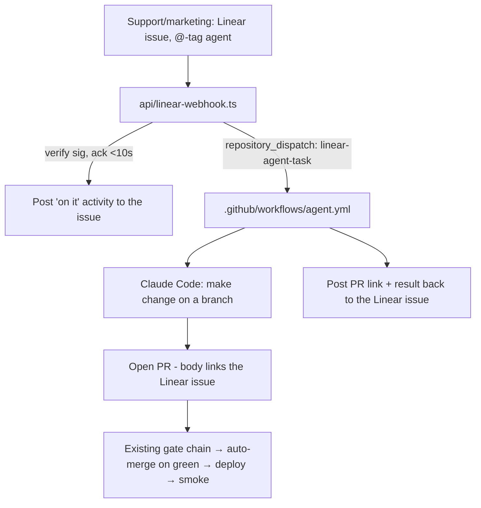

# feat: Linear agent intake — non-coder self-service front door

## Summary

The front door deferred from the safety-net plan (R1–R3, R13, R17): support/marketing file a Linear issue and tag an agent → the agent makes the change, opens a PR, and reports back to the issue. The PR then flows through the **already-live** gate chain (build, content/fact, a11y, links, prose, blast-radius) → auto-merge on green → deploy → smoke → rollback. This plan builds the *intake bridge*; the safety net it feeds into already exists and is enforced.

## Status note

This was written autonomously overnight as a **ready-to-review blueprint + scaffold**, not a tested implementation — it needs product/tooling decisions and credentials only you can provide (below). The scaffold files are marked and won't activate until secrets + a Linear app are configured.

## Decisions made (assumptions — flag any to change)

- KTD1. **Agent = Claude Code via GitHub Actions**, triggered by a Linear webhook → `repository_dispatch`. Rationale: self-hosted, runs in our own CI with repo access, opens normal PRs that hit the existing gates, and reuses the GitHub-native auto-merge already enabled. *Alternative considered:* Linear's native agent product (assign issue → vendor agent). Cleaner UX but ties us to a vendor's agent + its repo-access model. The webhook bridge here works with either — only `agent.yml` changes.
- KTD2. **Bridge = a Vercel serverless function** (`api/linear-webhook.ts`) in this repo. Vercel serves `api/*` as functions alongside the static site, so no new hosting. It acks Linear within the 10s window, verifies the signature, then fires `repository_dispatch`.
- KTD3. **The agent opens a PR; it never bypasses the gates.** The intake adds no merge authority — the safety net decides what ships. A content PR auto-merges on green; anything touching CODEOWNER paths (gates/config/facts) holds for human review, exactly as today.
- KTD4. **Identity = a dedicated least-privilege GitHub App** for the agent (not a human PAT, not a CODEOWNER, not on the bypass list) — preserves the separation-of-duties (KTD1 of the safety-net plan).

## High-Level flow

## Implementation Units

### U1. Linear webhook bridge (`api/linear-webhook.ts`)
- **Goal:** Receive Linear `AgentSessionEvent` (created/prompted) webhooks, verify the signature, ack within 10s, and trigger the agent via `repository_dispatch`. (R1, R2)
- **Files:** `api/linear-webhook.ts` (scaffolded), `docs/agent/pipeline-setup.md` (intake section).
- **Approach:** Verify `Linear-Signature` (HMAC-SHA256 over the raw body with `LINEAR_WEBHOOK_SECRET`). On an agent assignment/mention, immediately `200` + post a `thought` activity ("on it") via the Linear API, then `POST /repos/EndreElv/tangerine-webpage/dispatches` with `{event_type:"linear-agent-task", client_payload:{issueId, identifier, title, description, url}}`. Do the heavy work async (the dispatch), never inline (10s budget).
- **Test scenarios:** valid signature + assignment → 200 + dispatch fired; bad signature → 401; non-agent event → 200 no-op. (Verify with a Linear test webhook once configured.)

### U2. Agent runner (`.github/workflows/agent.yml`)
- **Goal:** On `repository_dispatch: linear-agent-task`, run the coding agent on the issue, open a PR linking the issue. (R2, R3)
- **Files:** `.github/workflows/agent.yml` (scaffolded).
- **Approach:** Checkout, run the Claude Code action with the issue title/description as the prompt + `AGENTS.md` as context, on a new branch; open a PR whose body contains the Linear issue magic-link (so Linear auto-links and moves status). The PR enters the existing gate chain. Use the dedicated GitHub App token (KTD4), not the default `GITHUB_TOKEN`, so the PR's checks re-trigger.
- **Test scenarios:** dispatch with a copy-edit task → branch + PR opened, gates run; PR links the issue.

### U3. Report back to Linear (`R13`, `R17`)
- **Goal:** Post the PR link, merge/deploy result, and rollback notices to the originating Linear issue.
- **Files:** extend `api/linear-webhook.ts` or a small `scripts/linear-notify.mjs` called from `agent.yml`, `changelog.yml`, `rollback.yml`.
- **Approach:** `agentActivityCreate`/comment via the Linear API keyed by `issueId`. Wire the changelog + rollback workflows to also notify the issue (they currently post to a channel only).
- **Test scenarios:** PR opened → issue gets the link; merge → "shipped" comment; rollback → alert comment.

## Activation (you — credentials/setup)
1. Create a **Linear app/agent** (`actor=app`, scopes `app:assignable` + `app:mentionable`); install to the workspace.
2. Create a **dedicated GitHub App** for the agent (least privilege: contents + pull-requests write on this repo only; not a CODEOWNER; not on the bypass list). Store its token as `AGENT_GH_TOKEN`.
3. Secrets: `LINEAR_WEBHOOK_SECRET`, `LINEAR_API_KEY`, `ANTHROPIC_API_KEY`, `AGENT_GH_TOKEN`.
4. Point the Linear webhook at the deployed `…/api/linear-webhook` URL.
5. Test end to end with a real "fix this typo" ticket; confirm it opens a PR, auto-merges on green, deploys, and reports back.

## Scope boundaries
- No new merge authority or gate changes — the safety net is unchanged.
- Business-metric rollback, multi-repo, and a richer agent UI remain out of scope.

## Sources
- Safety-net plan: `docs/plans/2026-06-05-001-feat-agentic-delivery-pipeline-plan.md`. Linear Agents (public beta 2026-03; `actor=app`, AgentSession webhook, 10s ack, `agentActivityCreate`, PR magic-links). GitHub `repository_dispatch` + the Claude Code action. Origin: the brainstorm requirements doc.
